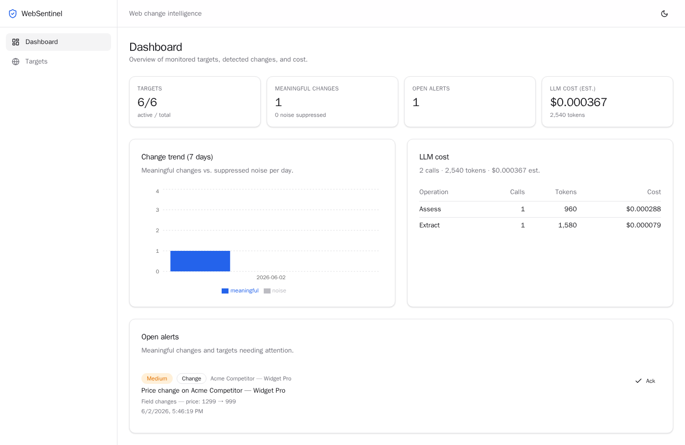
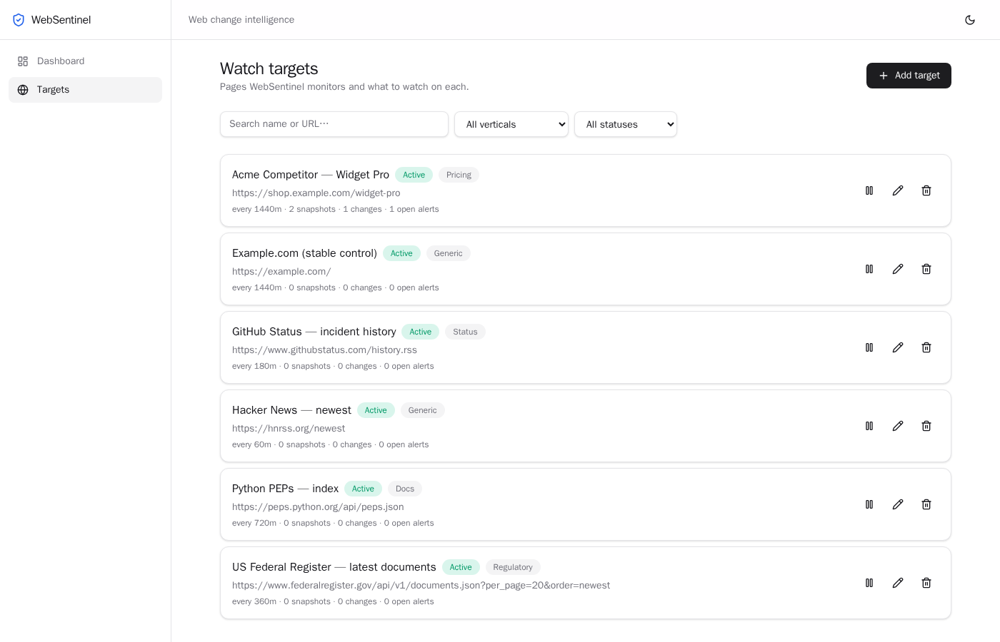
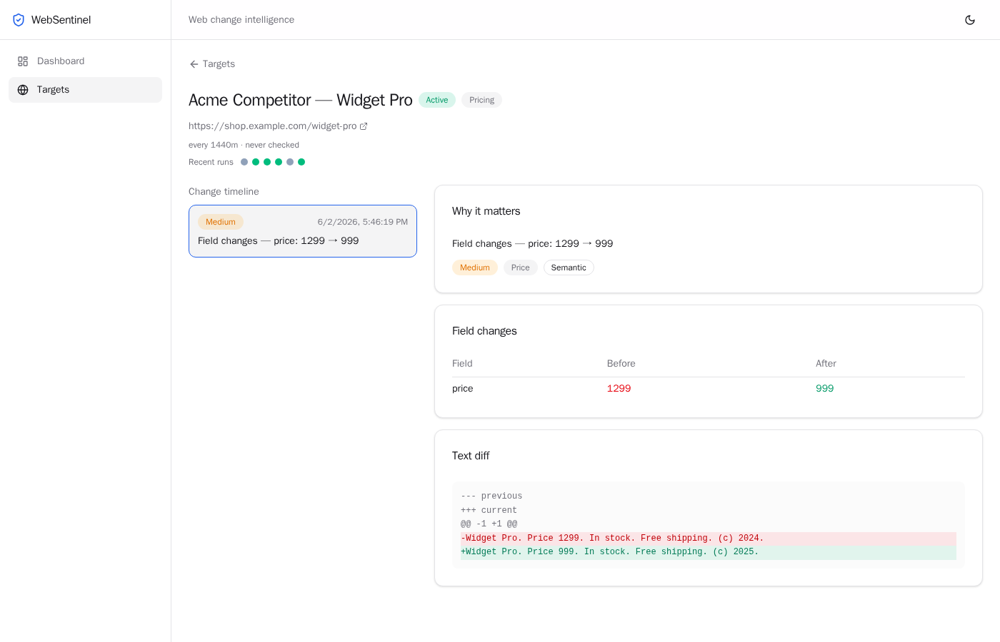
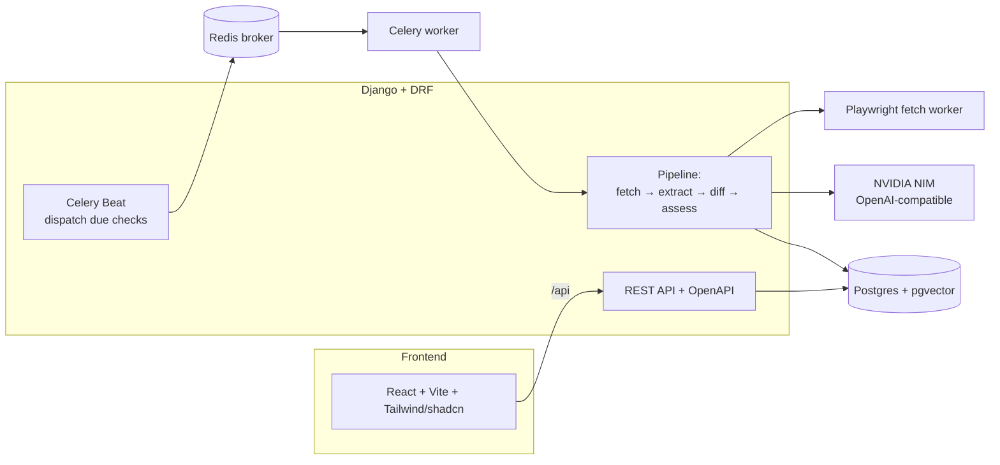

# WebSentinel

**Web change-intelligence platform** — watches the web pages that matter to a
business and reports, in plain language, _only_ when something important
actually changes.

The hard problem (and the differentiator) is **noise suppression**: telling a
real change — a price moved ₹1,299 → ₹999, a new data-retention clause appeared —
apart from cosmetic churn like rotating ads, footer dates, and session IDs.



> A local, runnable demo built end-to-end: `docker compose up`, seed real
> public targets, and watch it fetch live pages, suppress noise, detect
> meaningful changes, and raise alerts — with reproducible metrics.

## Contents

- [What it does](#what-it-does)
- [Screenshots](#screenshots)
- [Architecture](#architecture)
- [Tech stack](#tech-stack)
- [Quick start](#quick-start)
- [Web-fetching doctrine](#web-fetching-doctrine)
- [Metrics](#metrics)
- [Project layout](#project-layout)
- [Development](#development)

## What it does

You register **watch targets** (a URL + what you care about on it). A background
fleet then, per target:

1. **Fetches politely** — API/feed first, headless browser (Playwright) only
   when needed; respects robots.txt; paces requests; detects anti-bot
   challenges and degrades gracefully.
2. **Extracts** structured, typed fields (price, availability, clauses…) with
   cheap rule-based extractors first and an LLM only for what rules can't cover.
3. **Detects meaningful change** — structured field diffs + normalized-text
   comparison + pgvector embedding similarity — suppressing cosmetic churn.
4. **Assesses impact** — an LLM classifies _why it matters_, scores severity,
   and raises a plain-language alert (with a rule-based fallback when no key is
   set).

Everything runs locally and produces real results against real sites; the
quality of the detection is backed by a reproducible [evaluation harness](#metrics).

## Screenshots

| Watch targets                            | Change timeline + diff viewer                        |
| ---------------------------------------- | ---------------------------------------------------- |
|  |  |

## Architecture



A check is **due** when `now - last_checked_at >= check_interval_minutes`; Beat's
dispatcher enqueues those, the fetch worker runs the pipeline, and unchanged
pages are skipped by content hash before any LLM spend. See
[docs/architecture.md](docs/architecture.md) for the full data flow and models.

## Tech stack

| Layer              | Technology                                          |
| ------------------ | --------------------------------------------------- |
| Backend            | Django + Django REST Framework                      |
| Async / scheduling | Celery + Celery Beat (Redis broker)                 |
| Database           | PostgreSQL + pgvector                               |
| Browser automation | Playwright (Python), dedicated worker               |
| LLM                | NVIDIA NIM (OpenAI-compatible) behind a provider IF |
| Frontend           | React + Vite + TypeScript + Tailwind v4 + shadcn/ui |
| Packaging          | Docker + Docker Compose                             |
| Quality            | ruff + black + prettier + eslint, pytest, GitHub CI |

## Quick start

**Prerequisites:** Docker + Docker Compose.

```bash
cp .env.example .env
# Optional but recommended — enables LLM extraction/assessment + embeddings:
#   set NVIDIA_API_KEY=nvapi-... in .env (get one at https://build.nvidia.com)

docker compose up -d --build      # Postgres, Redis, API, worker, beat, fetch, frontend
```

- **Dashboard:** http://localhost:5173
- **API docs (Swagger):** http://localhost:8000/api/docs
- **Health:** http://localhost:8000/healthz

The backend applies migrations on start. Then run the demo and the metrics:

```bash
make demo    # seed real public targets and run live checks (or: docker compose exec backend python manage.py run_demo)
make eval    # print the reproducible §-metrics report
```

Without an `NVIDIA_API_KEY`, the pipeline degrades gracefully to rule-based
extraction + heuristic severity, and noise suppression still works (normalized
text + field diffs); embeddings and LLM explanations switch on once the key is set.

## Web-fetching doctrine

WebSentinel is a **polite monitor, not a scraping-evasion tool**:

- **API/feed first, browser second** — lightweight HTTP for feeds/APIs/static
  HTML; Playwright only when a page needs JS rendering.
- **Behaves politely** — respects `robots.txt`, sends a consistent honest
  user-agent, reuses a browser context, and paces requests per host.
- **Detect-and-degrade, never defeat** — on a CAPTCHA/anti-bot challenge it marks
  the target _blocked_, raises an informational alert, and moves on. No
  CAPTCHA-solving, no proxy rotation, no circumvention.
- **Monitoring-friendly demo targets** — government/regulatory, public-data,
  status, and feed-backed sources that change over days.

## Metrics

All metrics are computed by the evaluation harness against a hand-labelled
dataset and modeled scenarios — **reproducible with one command** and **no
network or API key required**:

```bash
make eval     # docker compose exec backend python manage.py run_eval
cd backend && pytest      # the same metrics asserted as tests
```

Latest measured run:

| Metric                                           | Result                                             | Method                                                                                                                                        |
| ------------------------------------------------ | -------------------------------------------------- | --------------------------------------------------------------------------------------------------------------------------------------------- |
| **False-positive reduction** (semantic vs naive) | **74%** (naive 99% → semantic 26% FP; recall 100%) | ~126 labelled change pairs (cosmetic noise vs meaningful); naive flags any text diff, semantic uses field-diff + normalized text + embeddings |
| **Extraction accuracy**                          | **100%** (rule-based fields)                       | 80 labelled price/availability fields across currencies and phrasings                                                                         |
| **LLM cost reduction**                           | **~89%** per check cycle                           | Modeled: skip-unchanged + cheap/strong model routing vs strong-model-on-every-page, with explicit token assumptions                           |
| **Latency** (local intelligence layer)           | **p50 ≈ 0.5ms, p95 ≈ 1.3ms**                       | extract + semantic diff over 500 synthetic pages (network/LLM excluded)                                                                       |
| **Reliability**                                  | **62% → 94%** eventual success                     | Retry-with-backoff under simulated transient failures (3 attempts)                                                                            |

Hard, embedding-only-suppressible noise is deliberately included so the
reduction is realistic rather than a fabricated 100%. Full methodology:
[docs/metrics.md](docs/metrics.md).

## Project layout

```
backend/     Django project, DRF API, Celery pipeline (fetch/extract/diff/assess),
             evaluation harness, NVIDIA NIM client (llm/)
frontend/    React + Vite + TypeScript dashboard (Tailwind v4 + shadcn/ui)
docker/      Dockerfiles (backend, fetch worker, frontend) + Postgres init
docs/        Architecture, metrics, ADRs, screenshots
```

## Development

```bash
# Linting/formatting (Python + web) via pre-commit
uv tool install pre-commit && pre-commit install
pre-commit run --all-files

# Backend tests / metrics
cd backend && pip install -r requirements-dev.txt && pytest

# Frontend
cd frontend && npm install && npm run dev   # lint: npm run lint, build: npm run build
```

CI (GitHub Actions) runs pre-commit, the backend pytest suite, and the frontend
lint + build on every push and PR.

## License

[MIT](LICENSE).
